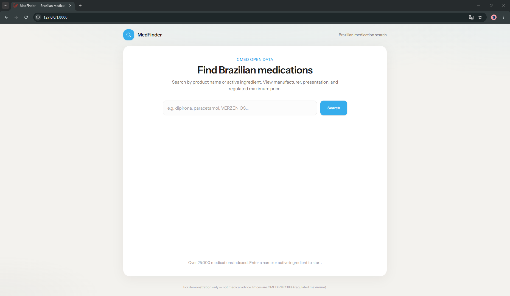
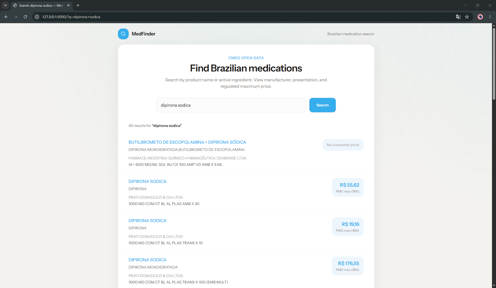
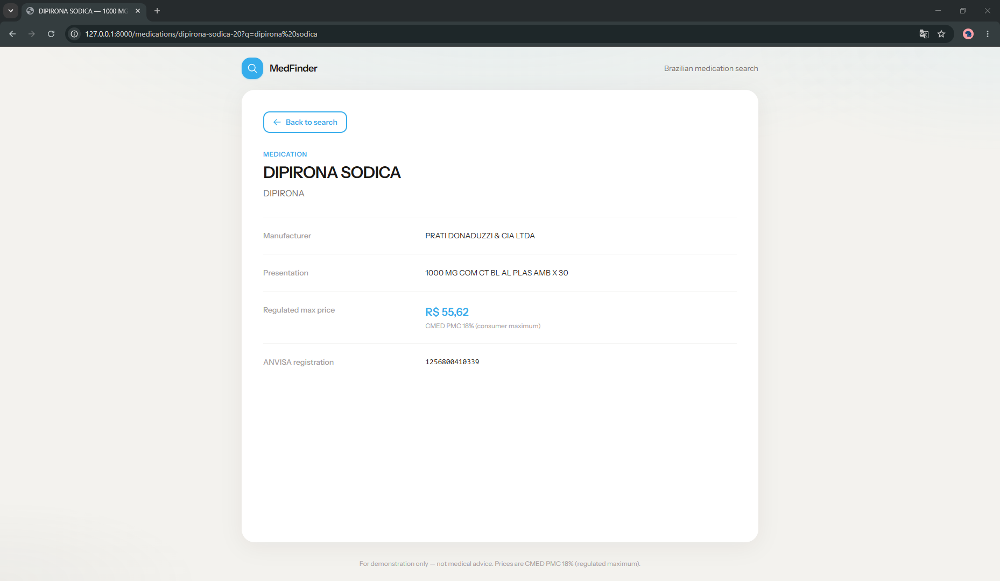
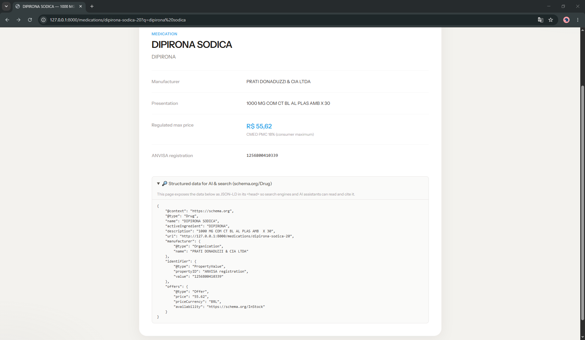
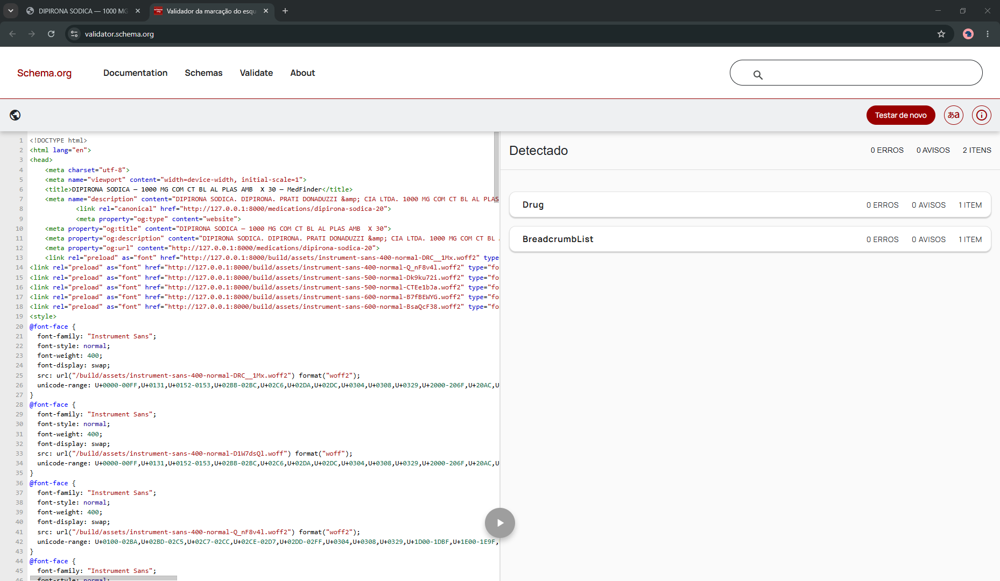

# MedFinder - Brazilian Medication Search

Search Brazilian medications by name or active ingredient and view manufacturer, presentation, and the government-regulated maximum price - on clean, SEO-friendly pages.

> **Portfolio project** by [Noh Ah Jeong](https://www.linkedin.com/in/noh-ah-jeong/) — a self-contained Laravel + MySQL build I made to demonstrate my full-stack work: importing a real 25,000-row government dataset, search with pagination, and SEO / structured-data (JSON-LD) detail pages. AI-assisted while building; I can walk through any part of the code.
>
> **Noh Ah Jeong** — Full-Stack Developer (Laravel · PHP · MySQL), São Paulo, Brazil · [LinkedIn](https://www.linkedin.com/in/noh-ah-jeong/) · [GitHub](https://github.com/nohahjeong)

## Screenshots



| Search & results | Medication detail |
|---|---|
|  |  |

> The detail page surfaces a **breadcrumb** and a collapsible **"Structured data" panel** — so the SEO/structured-data work is visible in the app, not just in the page source.

## Features
- Search by medication name or active ingredient, with pagination
- Detail pages with manufacturer, presentation, regulated price, and ANVISA registration
- Full SEO / structured-data layer — see [SEO & Structured Data](#seo--structured-data) below
- Data imported from Brazilian open data via `medications:import`

## SEO & Structured Data

The SEO layer is a first-class feature, not an afterthought. Each detail page emits:

- Dynamic `<title>` and a meta `description` (capped at 160 chars)
- **Open Graph** tags + a `canonical` link
- **`schema.org/Drug` JSON-LD** — name, active ingredient, manufacturer, the ANVISA
  registration (as an `identifier`), and the regulated price (as an `offers`/`Offer`)
- **`schema.org/BreadcrumbList` JSON-LD** + a matching visible breadcrumb
- SEO-friendly slug URLs (`/medications/{slug}`)

To make this *visible* (it normally lives only in `<head>`), each detail page also renders a
collapsible **"Structured data" panel** showing the exact JSON-LD it emits:



Example JSON-LD (Dipirona Sódica):

```json
{
  "@context": "https://schema.org",
  "@type": "Drug",
  "name": "DIPIRONA SÓDICA",
  "activeIngredient": "DIPIRONA",
  "description": "1000 MG COM CT BL AL PLAS AMB X 30",
  "url": "https://example.com/medications/dipirona-sodica",
  "manufacturer": { "@type": "Organization", "name": "PRATI DONADUZZI & CIA LTDA" },
  "identifier": { "@type": "PropertyValue", "propertyID": "ANVISA registration", "value": "1256800410339" },
  "offers": { "@type": "Offer", "price": "55.62", "priceCurrency": "BRL", "availability": "https://schema.org/InStock" }
}
```

The structured data parses cleanly in the [schema.org validator](https://validator.schema.org/) (paste the page HTML — both `Drug` and `BreadcrumbList` are recognized, no errors). `BreadcrumbList` is also a Google-supported rich result, testable in the [Rich Results Test](https://search.google.com/test/rich-results).



### GEO / AI-search
Structured data plus clean, semantic HTML help AI search engines (ChatGPT, Perplexity,
Google AI Overviews) read, understand, and cite the page — not only traditional search
crawlers. These are the same GEO (Generative Engine Optimization) principles I apply in
production work: make the meaning machine-readable so the content is citable.

## Tech
- Laravel 13 (PHP 8.3) · Blade · MySQL · Tailwind CSS · Vite

## Getting started

**Requires:** PHP 8.3+, Composer, Node.js, MySQL

```bash
composer install
cp .env.example .env
php artisan key:generate
# configure DB in .env, then:
php artisan migrate
php artisan medications:import
npm install && npm run build
php artisan serve
```

Re-import after updating the CSV (upserts by ANVISA registration):

```bash
php artisan medications:import --fresh
```

## Data source

**CMED "Lista de Preços de Medicamentos" (PMC list)** — one official file covers the whole data model (product, substance, lab, presentation, registration, and regulated price). Published monthly by ANVISA/CMED.
Link: [CMED preços](https://www.gov.br/anvisa/pt-br/assuntos/medicamentos/cmed/precos).

- **Downloaded file:** `database/data/cmed_pmc_2026-06-10.xlsx` (25,434 rows, 74 cols) → published **2026-06-10**.
- **Cleaned file:** `database/data/medications.csv` (derived from the XLSX above; 25,392 rows; 21,154 with a consumer price). Columns: `name`, `active_ingredient`, `manufacturer`, `presentation`, `price_max`, `registration`, `slug`.

**Normalization**
- The raw XLSX header is on **row 43** (rows 1–42 are legend/notes); data starts row 44.
- **`price_max` = PMC 18%** column (consumer max price at 18% ICMS, SP/RJ tax rate). Hospital-only meds have no PMC → `price_max` left blank.
- Prices converted from pt-BR (`11336,31`) to decimal (`11336.31`); accents preserved as UTF-8.

For demonstration only — not medical advice.

## License
MIT